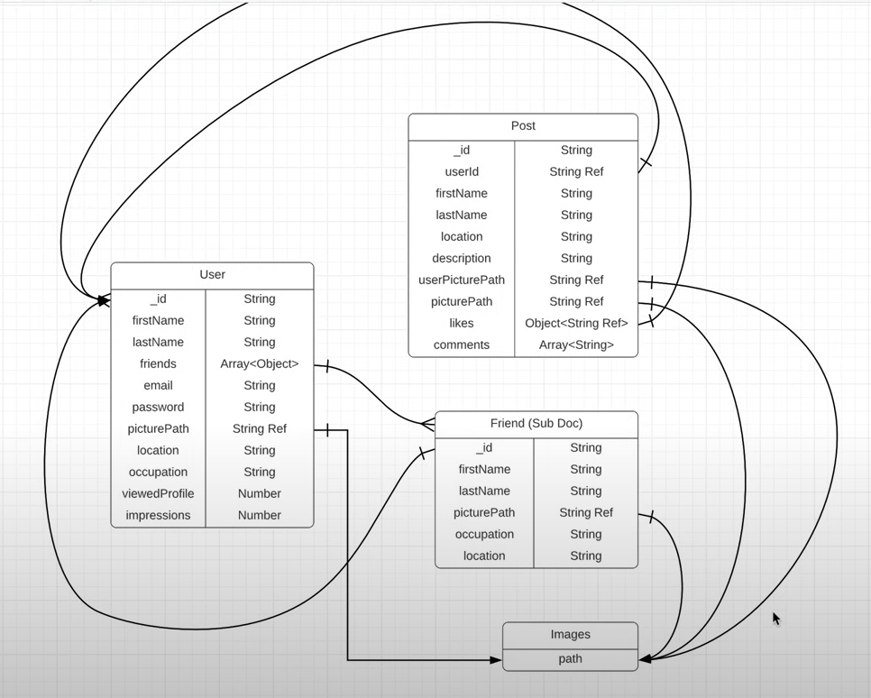

This is a MERN project from a Youtube Tutorial :D 
Link to project: https://www.youtube.com/watch?v=K8YELRmUb5o

### How to run the project
1. Clone the project
2. Run `npm install` in the root directory
3. Run `nodemon`

### DAY 1: Understanding MERN Stack and Setting up the Backend Server and Configurations, and Data Modeling

MERN Stack: MongoDB, Express, React, Node.js

- MongoDB: NoSQL Database
- Express: Backend Framework
- React: Frontend Framework
- Node.js: JavaScript Runtime Environment

Some notes:

For MoongoDB, we need to create a cluster and a database in MongoDB Atlas. Then, to connect the database to the server, we need to install mongoose and configure the connection in the server file.

There's a bunch of configurations, Ill slowly go over them throughou the project. 
- ```helmet()``` is a middleware that helps secure the app by setting various HTTP headers.
- ```cors()``` is a middleware that enables the server to allow requests from different origins.
- ```dotenv``` is a module that loads environment variables from a .env file into `process.env`.

Data Modeling:

- Interesting to note that `User` and `Friend` are not treated as the same object in the database. This is because the `Friend` object is a subdocument of the `User` object. MongoDB is a NoSQL database, so we can have nested objects like this.

### DAY 2: Authentication and Authorization in Node

- Authentication: The process of verifying the identity of a user.

- created an auth middleware that checks if the user is authenticated by checking the token in the request header.

- also created the User model and the auth controller that handles the login and register routes. in moongse, the `User` has to use a model, so we created a `UserSchema` and exported it as a model.

- created a place to keep basically all the routes in one place- `auth.js

- set up the login and register routes in the auth controller. the register route hashes the password before saving it to the database.

- usually companies have a third-party authenticator, which is way better than what we're doing lol 
